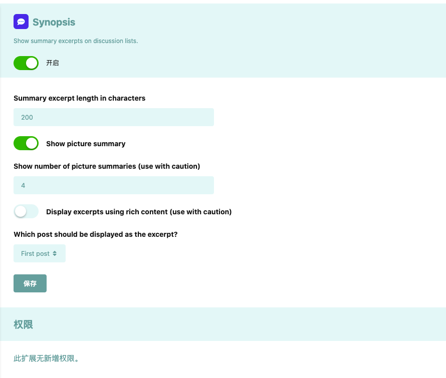

# Synopsis by Itlad

 [](https://packagist.org/packages/xinghua/synopsis)

A [Flarum](https://github.com/flarum/flarum) extension which adds summary excerpts to the discussion list. 
This is essentially the same as [IanM's](https://discuss.flarum.org/d/25772) [Summaries](https://github.com/imorland/synopsis) and[jordanjay29's](https://discuss.flarum.org/d/2151) [Summaries](https://github.com/jordanjay29/flarum-ext-summaries), with extra customisable options. If you don't need the extra options, I recommend using [Summaries](https://github.com/jordanjay29/flarum-ext-summaries) instead.

## Features
As well as displaying an excerpt as a summary (with configurable length):

 - All display strings are translatable
 - Toggle between displaying plain or rich content in the summary (admin)
 - Choose from using either the first or latest post in the summary (admin)
 - User preference to show/hide summaries
 - User preference to enable summaries on mobile
 - Support to display pictures in content
 - Support to set the number of pictures to be displayed

## Screenshots

#### Admin settings


#### content and images in summary


#### User settings

## Installation
```
composer require itlad/synopsis
```

### Updating
```
composer require itlad/synopsis
php flarum migrate
php flarum cache:clear
```

## Links
- [Github](https://github.com/imorland/synopsis)
- [Discuss](https://discuss.flarum.org/)  
- [Packagist](https://packagist.org/packages/xinghua/synopsis) 
- [Summaries by IanM](https://github.com/imorland/synopsis) 
- [Summaries by jordanjay29 (the original extension)](https://github.com/jordanjay29/flarum-ext-summaries) 
